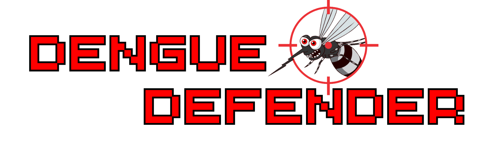

<div align="center">

#  Dengue Defenders


</div>

## Sobre o Jogo

Mosquitos da dengue atacam ao cair da tarde, mas a cidade está protegida! Um canhão imponente os luta para destruir todos os mosquitos enquanto o sol se despede. Ajude na batalha garantindo que todos os cidadãos da cidade fiquem a salvos da dengue.

## Como Jogar 

 `A`  = Move para esquerda
 
 `D`  = Move para direita

 `Mouse`  = Mira nos mosquitos
 
 `Botão esquerdo do mouse`  = Dispara tiros de canhão

 `______` = Muda o tipo de tiro do canhão

 `P`  = Pausa o jogo


## Requisitos para Execução

- [Git](https://git-scm.com/downloads)
- [Xmake](https://xmake.io/#/getting_started)
- [GCC](https://gcc.gnu.org) (Somente Linux)
- [Visual Studio](https://learn.microsoft.com/pt-br/cpp/build/vscpp-step-0-installation) (Somente Windows) com opção "Desenvolvimento para desktop com C++"

> [!WARNING]
> Dentro dos arquivos mosquito.cpp e canhao.cpp existem variáveis de velocidade que podem precisar de ajuste:
> float velocidadeQuedaMosquitos = 2.0f;
> float velocidadeTiroCanhao = 0.02f;

## Ferramentas Utilizadas

- [Git](https://git-scm.com/downloads)
- [Visual Studio Code](https://code.visualstudio.com/download)
- Bibliotecas [stb_image](https://github.com/nothings/stb/) e [freeglut](https://freeglut.sourceforge.net/)
  
## Clonar Repositório

```bash
git clone https://github.com/paulohebert/aedes-attack.git
```

## Compilar Projeto

```bash
xmake
```

## Executar Projeto

```bash
xmake run
```